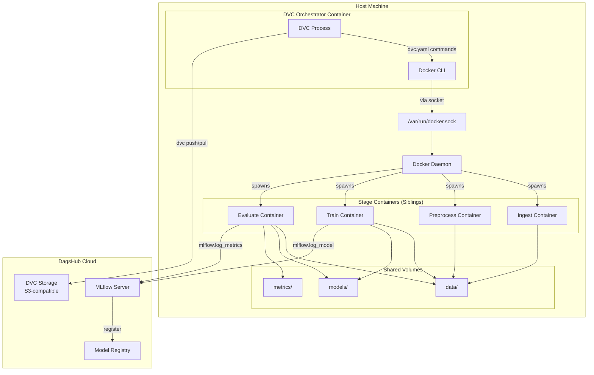
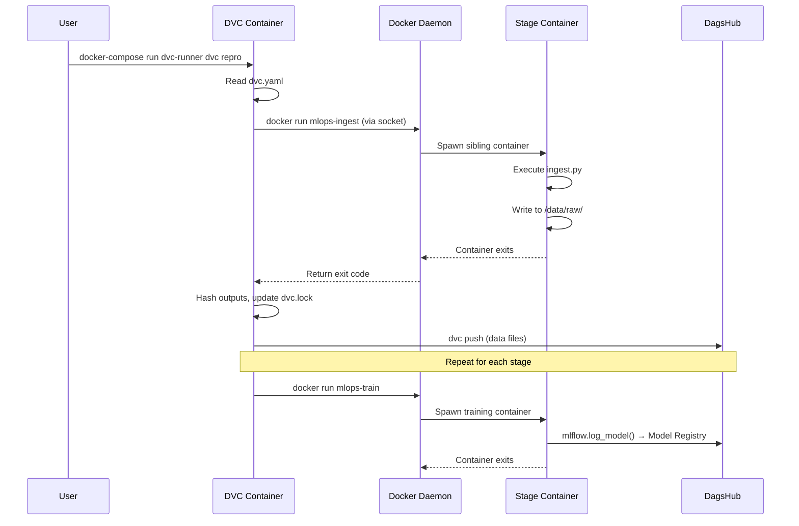
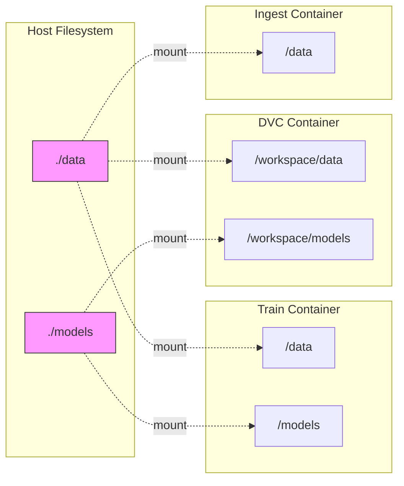

# Architecture Diagram

## System Architecture

```mermaid
graph TB
    subgraph "Host Machine"
        subgraph "DVC Orchestrator Container"
            DVC[DVC Process]
            DockerCLI[Docker CLI]
        end
        
        Socket["/var/run/docker.sock"]
        Daemon[Docker Daemon]
        
        subgraph "Stage Containers (Siblings)"
            Ingest[Ingest Container]
            Preprocess[Preprocess Container]
            Train[Train Container]
            Evaluate[Evaluate Container]
        end
        
        subgraph "Shared Volumes"
            DataVol[data/]
            ModelVol[models/]
            MetricsVol[metrics/]
        end
    end
    
    subgraph "DagsHub Cloud"
        DVCRemote[DVC Storage<br/>S3-compatible]
        MLflowServer[MLflow Server]
        ModelRegistry[Model Registry]
    end
    
    DVC -->|"dvc.yaml commands"| DockerCLI
    DockerCLI -->|via socket| Socket
    Socket --> Daemon
    Daemon -->|spawns| Ingest
    Daemon -->|spawns| Preprocess
    Daemon -->|spawns| Train
    Daemon -->|spawns| Evaluate
    
    Ingest --> DataVol
    Preprocess --> DataVol
    Train --> DataVol
    Train --> ModelVol
    Evaluate --> DataVol
    Evaluate --> ModelVol
    Evaluate --> MetricsVol
    
    DVC -->|dvc push/pull| DVCRemote
    Train -->|mlflow.log_model| MLflowServer
    MLflowServer -->|register| ModelRegistry
    Evaluate -->|mlflow.log_metrics| MLflowServer
```

## Data Flow

```mermaid
sequenceDiagram
    participant User
    participant DVC as DVC Container
    participant Docker as Docker Daemon
    participant Stage as Stage Container
    participant DagsHub
    
    User->>DVC: docker-compose run dvc-runner dvc repro
    DVC->>DVC: Read dvc.yaml
    DVC->>Docker: docker run mlops-ingest (via socket)
    Docker->>Stage: Spawn sibling container
    Stage->>Stage: Execute ingest.py
    Stage->>Stage: Write to /data/raw/
    Stage-->>Docker: Container exits
    Docker-->>DVC: Return exit code
    DVC->>DVC: Hash outputs, update dvc.lock
    DVC->>DagsHub: dvc push (data files)
    
    Note over DVC,DagsHub: Repeat for each stage
    
    DVC->>Docker: docker run mlops-train
    Docker->>Stage: Spawn training container
    Stage->>DagsHub: mlflow.log_model() → Model Registry
    Stage-->>Docker: Container exits
```

## Volume Sharing Pattern

```mermaid
graph LR
    subgraph "Host Filesystem"
        HostData["./data"]
        HostModels["./models"]
    end
    
    subgraph "DVC Container"
        DVCData["/workspace/data"]
        DVCModels["/workspace/models"]
    end
    
    subgraph "Ingest Container"
        IngestData["/data"]
    end
    
    subgraph "Train Container"
        TrainData["/data"]
        TrainModels["/models"]
    end
    
    HostData -.->|mount| DVCData
    HostModels -.->|mount| DVCModels
    HostData -.->|mount| IngestData
    HostData -.->|mount| TrainData
    HostModels -.->|mount| TrainModels
    
    style HostData fill:#f9f,stroke:#333
    style HostModels fill:#f9f,stroke:#333
```

View these diagrams on GitHub or using a Mermaid viewer.
